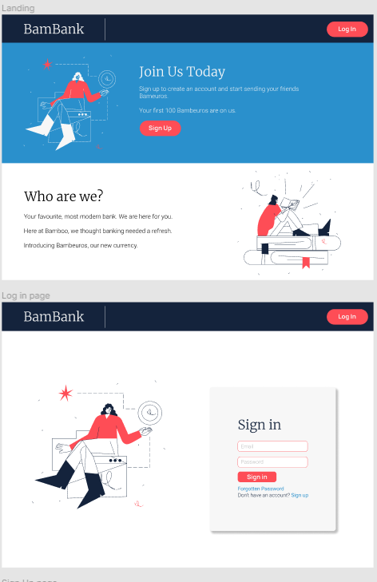
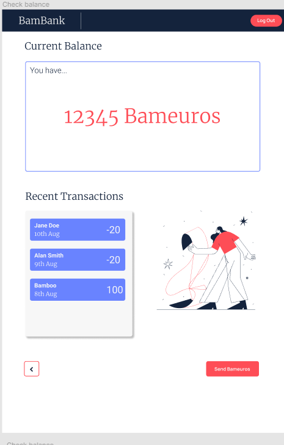
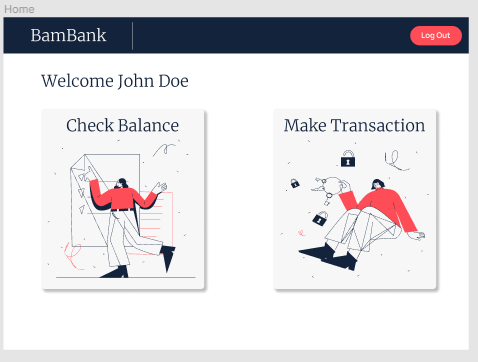
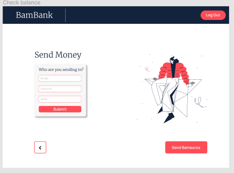

Completed this project for Bamboo Loans.

Web app is deployed at: https://5f3c311940696e0007185a8b--youthful-jennings-14e8c0.netlify.app/

Front end written in React, utilising tools such as styled-components and react-hook-forms.

Back end uses both AWS and Firebase, for differing purposes. Amplify Auth handles authentication, and Firebase Cloud Firestore handles all database operations.

Drew wireframes on Figma:

To run the app locally, follow these instructions:

1. git clone
2. navigate to root dir
3. npm i
4. npm run start
